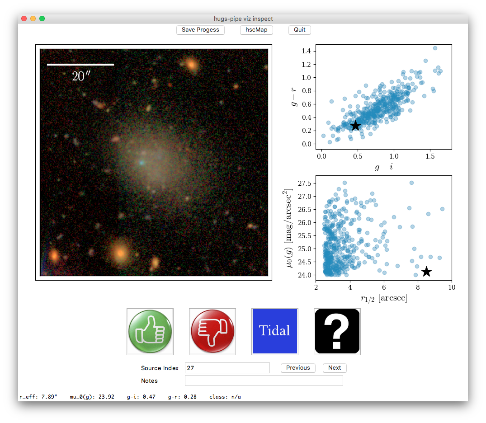

# The UDG-Zoo

## Installation

1. Clone this repository:
	
	```sh
	git clone https://github.com/johnnygreco/udg-zoo.git
	```

2. Get the contents of the `io` directory from me

3. If you don't have conda installed, get it:
	* [conda](https://conda.io/miniconda.html)
	
4. From within the udg-zoo directory, create a new conda enviornment with the necessary packages and activate the environment: 

	```sh
	conda env create
	source activate udg-zoo
	```
	
	You can deactivate the environment with

	```sh 
	source deactivate
	```
	
## Usage

From within the udg-zoo directory, run the application with

```sh
./enter-the-zoo.py
```

Several command-line arguments are available:

```sh
./enter-the-zoo.py --help

usage: ./enter-the-zoo.py [-h] [-r] [-c] [--io IO]

optional arguments:
  -h, --help     show this help message and exit
  -r, --review   review without classification
  -c, --clobber  delete previous progress without warning
  --io IO        input/output directory path (udg-zoo/io by default)
```

## Screen Shot


